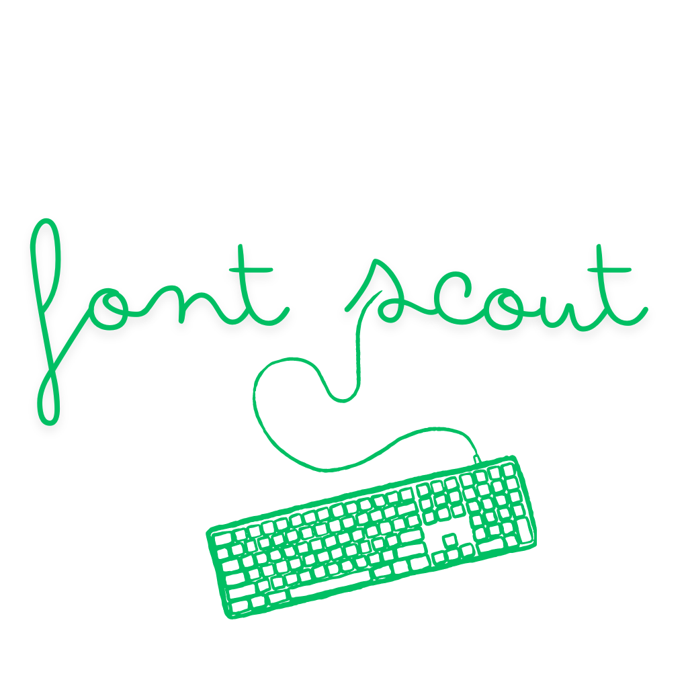

# FontScout - Find your Font (chrome extension)


<p></p>

Struggling to choose the right font for your website? I built Find Your Font (FontScout) to make it easier. With this Chrome extension, you can quickly test different Google fonts directly on your site and pick the one that fits best


## Download

Download the extension from [Chrome Extension store](https://chromewebstore.google.com/detail/font-tester/deachoodakeofjlfikfkohihnpcgiaim)

or

You can download the dist folder from releases and load it manually

## How to use FontScout?
1. Download FontScout from the Chrome Web Store
2. Pin the extension.
3. Click on the extension and wait for it to load on your website.
4. Highlight your text, choose a font, and copy the code. Done!


## Features of FontScout
✅ Test 1000+ google fonts <br>
✅ Move the modal around the webpage. <br>
✅ Set italics, underline, weights, line height etc. <br>
✅ Set font size and color<br>


---

## Current limitations
* If the FontScout doesn't open even after double click on a website, please file an issue


### Contributing

The `manifest.json` required for extension is located inside the public folder.

To load the extension locally. Go to extension -> Load unpacked -> point to dist folder (the build folder).

For development use
```
npm run build:dev
```
This is because the extension requires to point to the build folder, using this command you
won't have to rebuild on every save.
